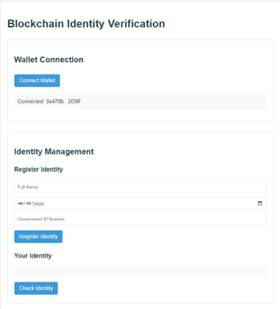

# Decentralized Identity Verification System

This project demonstrates the implementation of a secure and transparent identity verification system using **Ethereum smart contracts**, providing users full control over their personal identity data without relying on a centralized authority.

## Overview

Traditional identity management systems often depend on centralized authorities, creating risks such as data breaches, unauthorized access, and loss of user control. To address these limitations, this project leverages **blockchain technology** and **Self-Sovereign Identity (SSI)** principles to implement a decentralized identity management and verification framework.

The system allows:
- **Users to register and check identity information**
- **Admins to verify or revoke identities**
- **Secure and transparent data storage using the Ethereum blockchain**

## Features

- **User Identity Registration:** Users can register their name, date of birth, and identification number.
- **Identity Verification (Admin-only):** Admin (the contract owner) can verify or revoke registered identities.
- **Identity Query:** Users can check their registered identity information and verification status.
- **Smart Contract-Based Access Control:** Only the contract owner can verify/revoke identities.
- **Gas-Efficient Smart Contracts:** Optimized functions for lower gas consumption.
- **MetaMask Integration:** Secure wallet-based transaction signing and user authentication.
- **Local Testnet Deployment via Ganache and Remix IDE.**

## Technologies Used

- **Solidity**: Smart contract development language.
- **Remix IDE**: Online Solidity development and deployment environment.
- **Ganache**: Personal Ethereum blockchain for local testing.
- **MetaMask**: Ethereum wallet browser extension for transaction signing and account management.
- **Web3.js**: JavaScript library for interacting with the Ethereum blockchain.
- **Python HTTP Server**: For serving the frontend locally.

## Performance Metrics

| Metric                   | Estimated Gas |
|:-------------------------|:--------------|
| Contract Deployment       | 1,300,000–1,500,000 gas |
| Register Identity         | 130,000–150,000 gas |
| Verify / Revoke Identity  | 30,000–40,000 gas |
